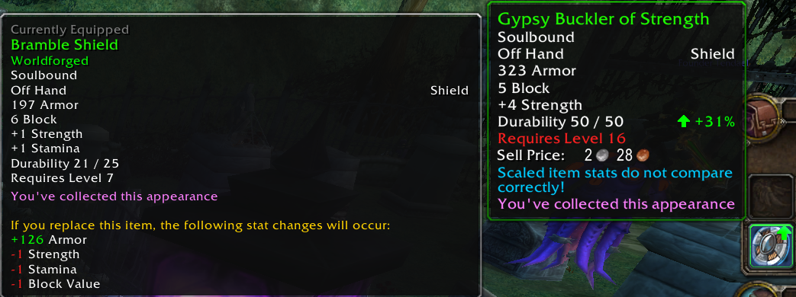
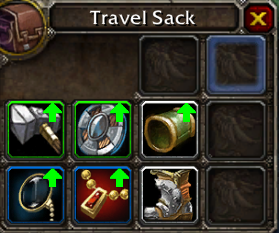
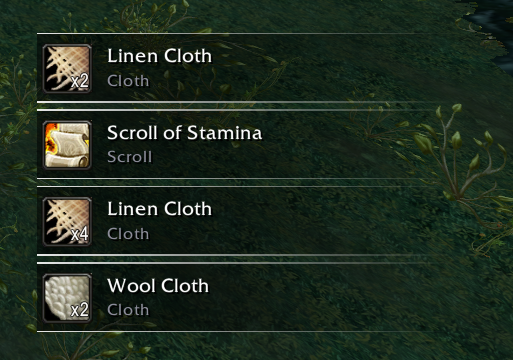
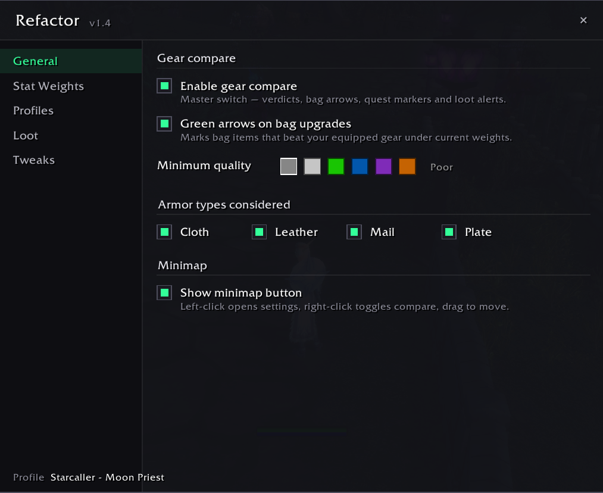
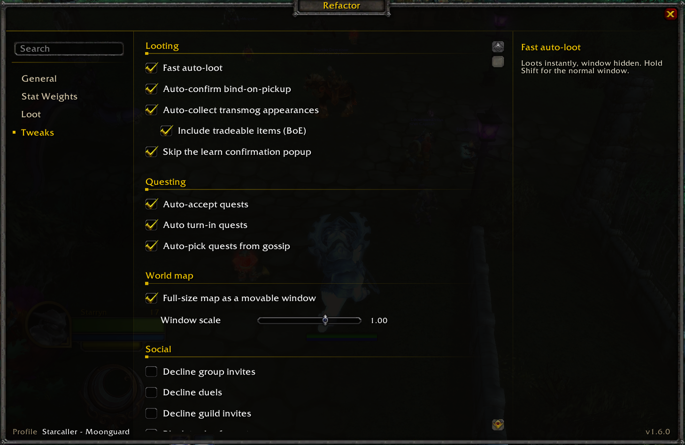
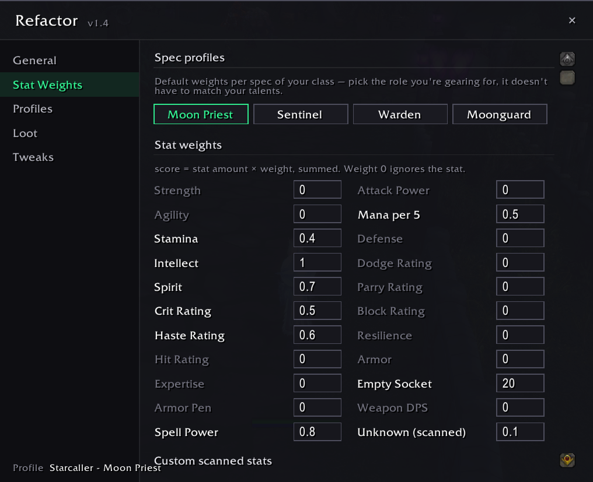
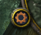

# Refactor

A World of Warcraft addon for **[Ascension](https://ascension.gg)**, a custom classless WotLK 3.3.5 server. Refactor scores your gear against your own stat priorities, tells you the moment an item is an upgrade, and smooths out a pile of everyday annoyances — auto-loot, quest automation, transmog collection, and more.

> Built specifically for Ascension's Conquest of Azeroth system: 21 classes × 3-4 talent specs, each with hand-tuned default stat weights, plus support for Ascension's server-side item scaling that most gear-scoring addons don't account for.

---

## Features

### 📊 Weighted Stat Gear Comparison
The core feature. Assign your own weight to every stat (Strength, Agility, Crit, Haste, weapon DPS, etc.), and Refactor scores every item you hover or loot against what you currently have equipped.

- Instant **% upgrade / downgrade verdict** as a tooltip overlay
- Green arrows on bag items that are upgrades
- Smart slot logic — rings/trinkets/one-handers compare against your *weaker* equipped item, two-handers compare against your combined main+off hand
- Correctly handles Ascension's **item scaling**: because Ascension scales item instances server-side (two copies of the same item link can have different stats), Refactor scans the *live* tooltip instead of trusting the item link — so verdicts are always accurate for the item actually in your bag, not some generic base version.
- Never guesses: if an item can't be scanned (not cached client-side, hard requirement not met, etc.), no verdict is shown rather than a misleading one.

### 🏆 Class & Spec Profiles
- Auto-detects your class and primary talent spec and seeds a matching profile with community-sourced default weights the first time you log in
- Switch, save, and manage multiple named weight profiles per character
- Auto-selection pauses if you manually switch profiles, and resumes with a simple command

### 🎁 Loot Toasts
Since Refactor auto-loots instantly (see below), the stock loot window never shows — so Refactor replaces it with animated toast popups: item icon, quality-colored name, stack count, and (if it's an upgrade) a pulsing glow with the % gain.

### ⚙️ Quality-of-Life Tweaks
All individually toggleable:
- Fast auto-loot (no more loot window delay)
- Auto-collects transmog appearances from your bags
- Tooltip follows your cursor, with a border colored by item quality
- Auto-confirms Bind-on-Pickup loot prompts
- Quest automation — auto-accept, auto turn-in, gossip/greeting quest picking (hold **Shift** to fall back to manual for any step)
- Hides red UI error text and mutes the "I can't do that yet" error voice line

### 🖥️ In-Game Config Window
A clean, single-panel UI for everything above — no `/reload` required, changes apply instantly.

---

## Installation

1. Download the latest release (or clone this repo).
2. Copy the `Refactor` folder into your Ascension `Interface\AddOns\` directory.
3. Launch the game and make sure **Refactor** is enabled on the AddOns screen.

---

## Usage

| Command | Effect |
|---|---|
| `/rfc` | Open the Refactor config window |
| `/rfc auto` | Resume automatic spec-based profile selection |
| `/rfc debug` | Print tooltip-scan debug info on hover |
| `/rfct` | Toggle loot toasts |
| `/rfct unlock` / `lock` | Move / lock the loot toast anchor |
| `/rfct reset` | Reset the loot toast anchor position |
| `/rfct test` | Preview a sample loot toast |

You can also open the config window from the **minimap button** — left-click to open, right-click for a quick master toggle, drag to reposition.

---

## Screenshots

_Images coming soon. If you'd like to contribute screenshots, see the descriptions below for what's needed._

### Gear comparison tooltip

### Bag upgrade arrows

### Loot toast

### Config window — General page

### Config window — Tweaks page

### Config window — Stat Weights page

### Minimap button

---

## Compatibility

- Client: WotLK 3.3.5 (Interface 30300), Ascension-specific build
- Bag addon support: works with the default Blizzard container frames and hooks Bagnon's item slots directly if installed

## Contributing

Issues and pull requests are welcome. If you're proposing new default stat weights for a class/spec, please explain your reasoning (source theorycraft, Pawn string, etc.) in the PR description.

## License

No license specified yet — all rights reserved by default until one is added.
