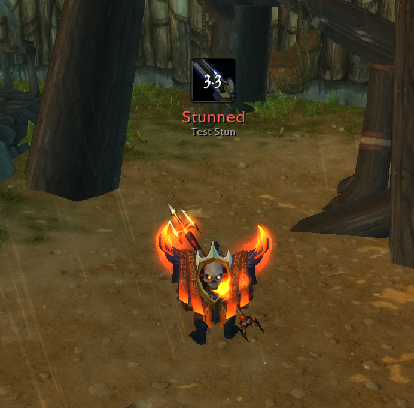

# Refactor

**Know instantly when an item is an upgrade — and skip the busywork in between.**

A World of Warcraft addon for **[Ascension](https://ascension.gg)**, a custom classless WotLK 3.3.5 server. Refactor scores your gear against your own stat priorities and smooths out a pile of everyday annoyances: auto-loot, quest automation, transmog collection, and more.

> Built for Ascension's Conquest of Azeroth system — 21 classes × 3-4 specs, each with hand-tuned default stat weights — and for Ascension's server-side item scaling that most gear-scoring addons get wrong.

---

## Features

### 📊 Weighted stat gear comparison
The core feature. Weight every stat (Strength, Agility, Crit, Haste, weapon DPS, …); Refactor scores every item you hover or loot against what you have equipped.

- Instant **% upgrade / downgrade verdict** in the tooltip
- Green arrows on upgrade items in your bags
- Smart slot logic — rings/trinkets/one-handers compare against your *weaker* equipped item; two-handers against combined main+off hand
- **Smart equip** — right-clicking into a full pair replaces whichever equipped item is actually weaker, not just the first slot
- **Handles Ascension item scaling** — two copies of the same link can have different stats, so Refactor scans the *live* tooltip instead of trusting the link
- **Never guesses** — if an item can't be scanned, no verdict is shown rather than a misleading one

### 🏆 Class & spec profiles
- Auto-detects your class and primary spec and seeds a matching profile with community-sourced weights on first login
- Switch, save, and manage multiple named profiles per character
- Auto-selection pauses if you switch manually, and resumes with `/rfc auto`

### 🎁 Loot toasts
Refactor auto-loots instantly, so the stock loot window never shows — animated toasts replace it: item icon, quality-colored name, stack count, and a pulsing % gain if it's an upgrade. Optional auction-house value per stack (Auto/TSM/Auctionator).

### 💫 Crowd-control alert
The 3.3.5 client has no loss-of-control display. While you're stunned, feared, polymorphed, or otherwise CC'd, Refactor shows a large center-screen icon with a cooldown spiral, a label, and a countdown. Recognizes all 21 CoA classes' CC plus NPC/boss CC. Movable and testable on the Tweaks page.

### ⚙️ Quality-of-life tweaks
All individually toggleable on the Tweaks page:

- **Fast auto-loot** — no loot-window delay
- **Auto-confirm** Bind-on-Pickup prompts
- **Auto-collect** transmog appearances from your bags
- **Cursor tooltip** with quality-colored border
- **Quest automation** — auto-accept, auto turn-in, gossip/greeting picking
- **Hide red error text** and mute the "I can't do that yet" voice line
- **Mute the cast-deny fizzle sound** — needs the one-click client patch, see [Installation](#installation)
- **World map** — scroll-to-zoom, click-drag pan, class-colored party/raid dots (ported from Magnify-WotLK); optional coords and fade-while-moving
- **Fullscreen map** as a movable, resizable window instead of a blackout
- **Auto-sell grays & auto-repair** at merchants (own money only)
- **Auto-decline** party/duel/guild invites and stranger trades; **auto-accept** BG resurrections
- **Quick invite** — Alt+Right-Click a player to invite
- **Seamless bag upgrade** — right-click a full bag to auto-swap in your smallest one
- **New-version notice** when a guildmate or group member runs a newer build
- **Leave party** on clicking Leave Dungeon

> Most automation tweaks are **off by default** and honor **Shift-to-cancel** — hold Shift to handle any single step manually.

### 🖥️ In-game config window
One clean panel for everything above — no `/reload`, changes apply instantly. Open with `/rfc` or the minimap button.

---

## Installation

1. Download the latest release (or clone this repo).
2. Copy the `Refactor` folder into your Ascension `Interface\AddOns\` directory.
3. Launch the game and enable **Refactor** on the AddOns screen.

### Optional: mute the cast-deny fizzle sound

The fizzle noise on a denied cast is played by the game engine — an addon alone can't mute it. Refactor ships a client patch that swaps those five sound files for silent copies:

1. Open `Interface\AddOns\Refactor\client-patch\` and double-click **`install-silent-fizzles.cmd`**.
2. Restart the game.
3. The **"Mute cast-deny sounds"** checkbox on the Tweaks page now works as an instant in-game toggle.

To undo, run `uninstall-silent-fizzles.cmd` from the same folder and restart. Without the patch, leave the checkbox ticked — unticking it would play the sound twice.

---

## Usage

| Command | Effect |
|---|---|
| `/refactor` or `/rfc` | Open the config window |
| `/rfc auto` | Resume automatic spec-based profile selection |
| `/rfc debug` | Print tooltip-scan debug info on hover |

Open the config window from the **minimap button** too — left-click to open, right-click for a master toggle, drag to reposition.

---

## More screenshots

| | |
|---|---|
|  |  |
| **General page** | **Tweaks page** |
|  |  |
| **Stat Weights page** | **Minimap button** |

---

## Compatibility

- **Client:** WotLK 3.3.5 (Interface 30300), Ascension-specific build
- **Bag addons:** default Blizzard container frames, plus Bagnon, DragonUI's Combuctor bags, AdiBags, and ElvUI

## Contributing

Issues and PRs welcome. If you're proposing new default stat weights, please explain your reasoning (theorycraft source, Pawn string, etc.) in the PR.

## Support

If you enjoy this addon, you can buy me a coffee on Ko-fi!

## License

[MIT](LICENSE) — do whatever you want with it, just keep the copyright notice.
